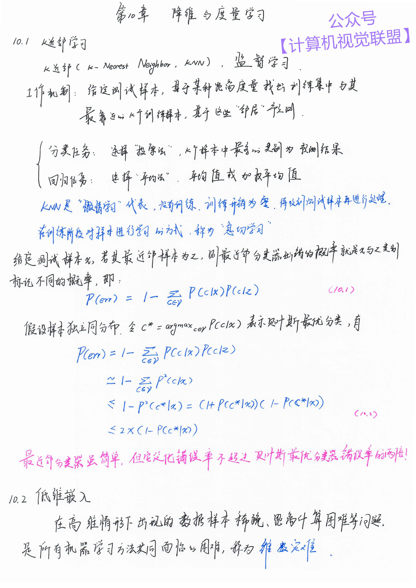
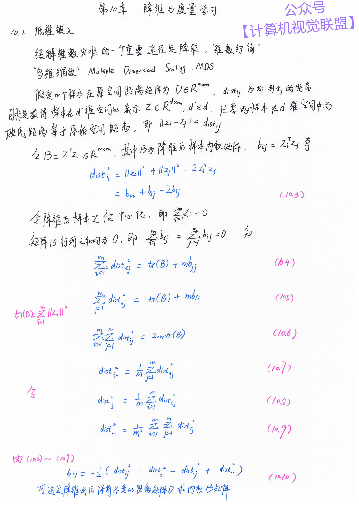
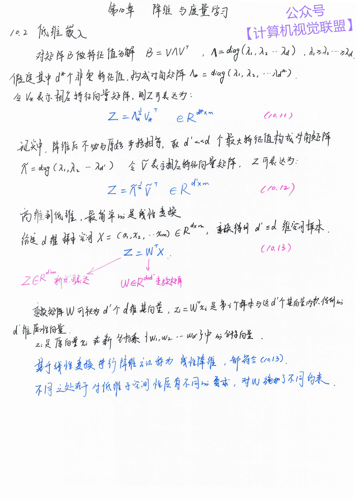
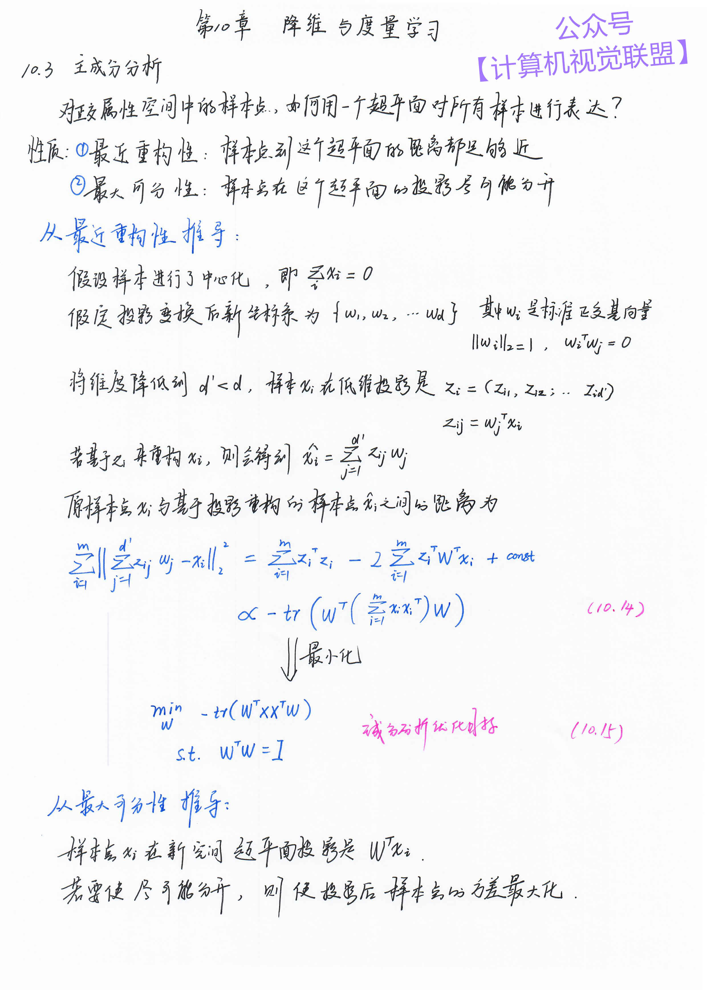
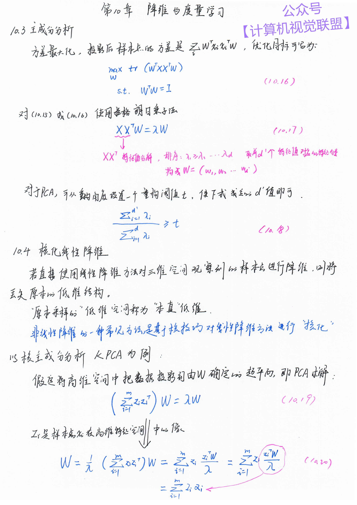
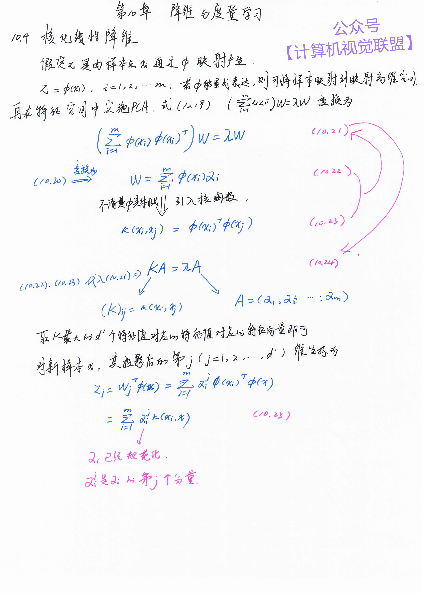
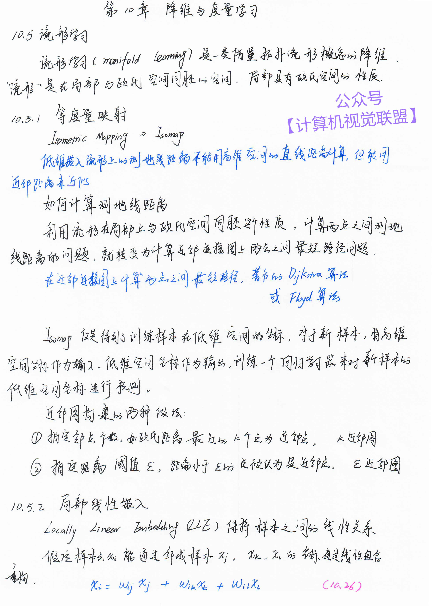
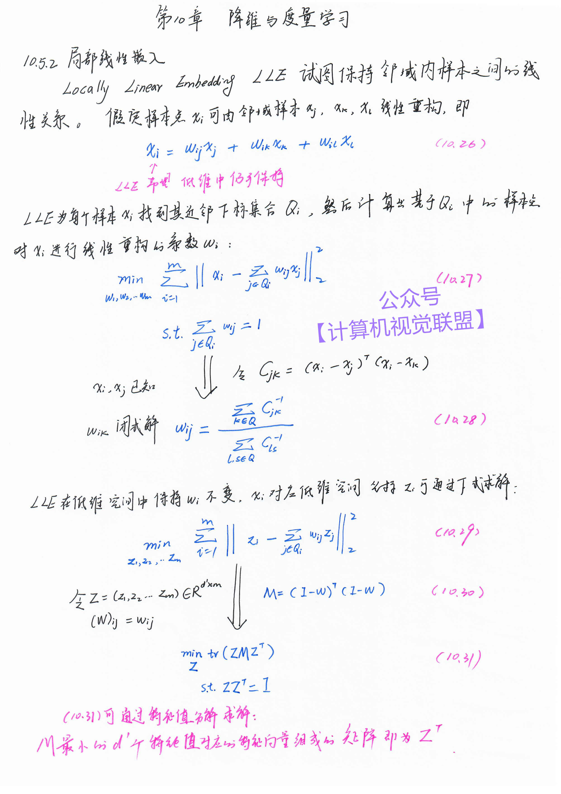
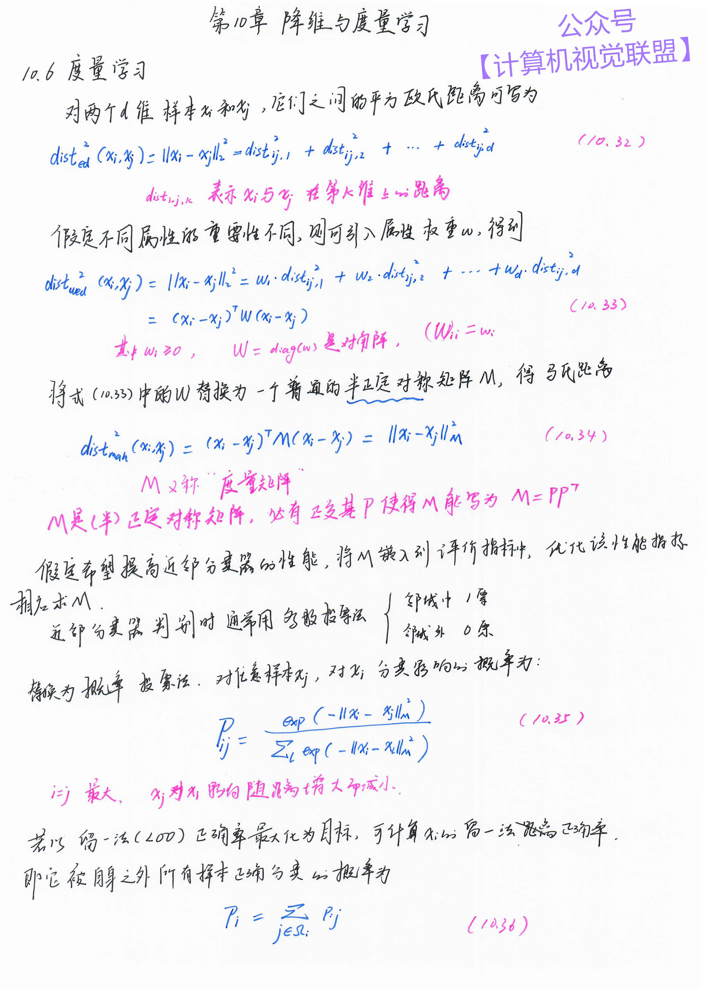
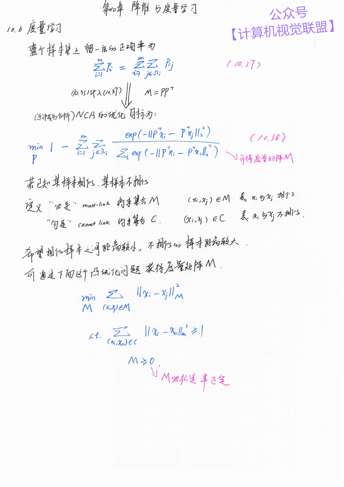

### Machine-Learning-Notes(加载图片较慢，请耐心等待,只显示一部分)
* 如果刷新不出来，可以点击 [神经网络](https://mp.weixin.qq.com/s/usIVYjffOL6oBUGUDalYLg)  查看笔记大概是什么样子的

* 周志华《机器学习》手推笔记（踏踏实实把公式学习推导一遍）

* by 【计算机视觉联盟】 王博Kings、Sophia

# 手推笔记十六章 214页 A4纸，可直接打印 ！！

*Last updated: 2021/03/13*   **更新完结十六章**

## 公众号【计算机视觉联盟】回复【西瓜书手推笔记】即可获得百度云pdf下载链接

## 后续请大家继续关注另一个重磅笔记： [**深度学习手推笔记**](https://github.com/Sophia-11/DeepLearningNotes)

## Table of Contents
- [第一章绪论](https://github.com/Sophia-11/Machine-Learning-Notes/)
- [第二章模型评估与选择](https://github.com/Sophia-11/Machine-Learning-Notes/)
- [第三章线性模型](https://github.com/Sophia-11/Machine-Learning-Notes/)
- [第四章决策树](https://github.com/Sophia-11/Machine-Learning-Notes/)
- [第五章神经网络](https://github.com/Sophia-11/Machine-Learning-Notes/)
- [第六章支持向量机](https://github.com/Sophia-11/Machine-Learning-Notes/)
- [第七章贝叶斯分类器](https://github.com/Sophia-11/Machine-Learning-Notes/)
- [第八章集成信息](https://github.com/Sophia-11/Machine-Learning-Notes/)
- [第九章聚类](https://github.com/Sophia-11/Machine-Learning-Notes/)
- [第十章降维与度量学习](https://github.com/Sophia-11/Machine-Learning-Notes/)
- [第十一章特征选择与稀疏学习](https://github.com/Sophia-11/Machine-Learning-Notes/)
- [第十二章计算学习理论](https://github.com/Sophia-11/Machine-Learning-Notes/)
- [第十三章半监督学习](https://github.com/Sophia-11/Machine-Learning-Notes/)
- [第十四章概率图模型](https://github.com/Sophia-11/Machine-Learning-Notes/)
- [第十五章规则学习](https://github.com/Sophia-11/Machine-Learning-Notes/)
- [第十六章强化学习](https://github.com/Sophia-11/Machine-Learning-Notes/)

## 手推笔记作者简介--王博Kings
微信号（Kingsplusa）备注：单位/学校+研究方向

985AI博士，CSDN博客专家，华为云享专家

已连载系列《机器学习》西瓜书手推笔记

已完结待更笔记：《深度学习-花书手推笔记》、《无人驾驶手推笔记》、《SLAM 十四讲》

| 下载地址 | 博士私人微信 |
|:-----------:|:-----------:|
||| 
|【计算机视觉联盟】回复【西瓜书手推笔记】即可获得百度云pdf下载链接|985AI博士，CSDN博客专家|

## 第一章 绪论

 

## 第二章  模型评估与选择
| 1 | 2 | 3 |4 |
|:-----------:|:--------:|:---------:|:---------:|
|| | |  | 
|| | |  | 
|| | |  | 
||--by 王博Kings||| 

## 第三章  线性模型
| 1 | 2 | 3 |4 |
|:-----------:|:--------:|:---------:|:---------:|
|| | |  | 
|| | |  | 
|| |--by 王博Kings| | 

## 第四章   决策树
| 1 | 2 | 3 |4 |
|:-----------:|:--------:|:---------:|:---------:|
|| | |  | 
|| | |  | 
|| | |  --by 王博Kings| 

## 第五章   神经网络
| 1 | 2 | 3 |4 |
|:-----------:|:--------:|:---------:|:---------:|
|||||
||||
|||  --by 王博Kings| 

## 第六章   支持向量机
| 1 | 2 | 3 |4 |
|:-----------:|:--------:|:---------:|:---------:|
|||||
||||
||||
||||

## 第七章    贝叶斯分类器
| 1 | 2 | 3 |4 |
|:-----------:|:--------:|:---------:|:---------:|
|||||
||||
||||
||||--by 王博Kings| 

## 第八章   集成信息
| 1 | 2 | 3 |4 |
|:-----------:|:--------:|:---------:|:---------:|
|||||
|||||
|||||

## 第九章   聚类
| 1 | 2 | 3 |4 |
|:-----------:|:--------:|:---------:|:---------:|
|||||
|||||

## 第十章  降维与度量学习
| 1 | 2 | 3 |4 |
|:-----------:|:--------:|:---------:|:---------:|
|||||
|||||
||||--by 王博Kings|
